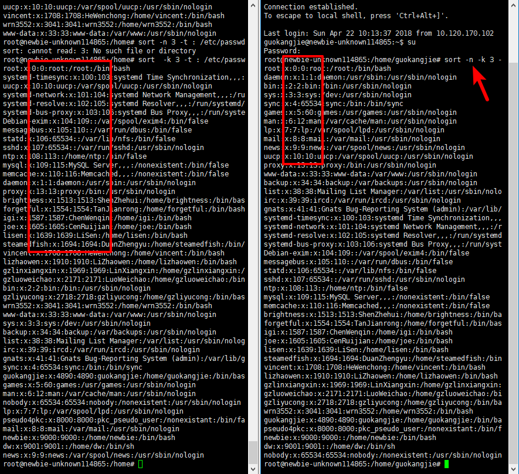

[TOC]
# 3. 文本处理
## 3.1. cut
```bash
-b, --bytes=LIST select only these bytes 字节
-c, --characters=LIST select only these characters 字符
-f, --fields=LIST select only these fields 域 ; also print any line that contains no delimiter character, unless the -s option is specified
```
### 1. cut 默认的分隔符是什么，如何设置分隔符？
-d, --delimiter=DELIM use DELIM instead of TAB for field delimiter
默认是tab
```shell
cut -d' '
```

### 2. 对于每一行，如何让 cut 仅显示第 3 到第 5 列？
```shell
ps -eopid,uid,cmd
ps -L u n | tr -s " " | cut -d " " -f 2,3,14-;
ps -ef | cut -f3-5
```

### 3. 对于每一行，如何让 cut 仅显示第 10 到第 15 个字符？
```shell
ps -ef | cut -b10-15
```
### 4. 在什么情况下，`-c` 和 `-b` 的输出有区别？
中文提取的情况：
```shell
[rocrocket@rocrocket programming]$ cat cut_ch.txt
星期一
星期二
[rocrocket@rocrocket programming]$ cut -b 3 cut_ch.txt
�
�
[rocrocket@rocrocket programming]$ cut -c 3 cut_ch.txt
一
二
```
遇到中文等字符，用-c则会以字符为单位，输出正常；
而-b只会以字节（8位二进制位）来计算，输出就是乱码。

## 3.2. sort
### 1. 如何对每行第 3 列进行排序？
-n, 以数值来排序
--numeric-sort compare according to string numerical value 以数值来排序
-k, 以第k列进行排序
--key=POS1[,POS2] start a key at POS1, end it at POS2 (origin 1) d
-t, 以？为分隔符
--field-separator=SEP use SEP instead of non-blank to blank transition
```shell
sort -n -k 3 -t : /etc/passwd
```
### 2. 请给出具体例子说明什么情况下使用了 `-n` 会导致 sort 的输出和不加 `-n` 不一致。
    -n, 以数值来排序
    --numeric-sort compare according to string numerical value 以数值来排序
    

### 3. 请了解 `-u`/`-r` 的意义。
-r, --reverse reverse the result of comparisons
默认升序，加-r就是降序排列
-u, --unique with -c, check for strict ordering;
排除重复项

### 4. 默认的分隔符是什么，如何指定分隔符？
-t, 以？为分隔符
--field-separator=SEP use SEP instead of non-blank to blank transition

### 5. 请给出 `-T` 参数的使用场景。
-T, --temporary-directory=DIR use DIR for temporaries, not $TMPDIR or /tmp;
multiple options specify multiple directories
--parallel=N change the number of sorts run concurrently to N

## 3.3. tail/head

### 1. 如何取得一个文件的前几个字符？
```shell
head -c <n字节> filename
```

### 2. `tail -f` 是干什么的，和 `tail -F` 有什么区别？
-f, --follow[={name|descriptor}]
output appended data as the file grows;
an absent option argument means 'descriptor'
-F same as --follow=name --retry
-q, --quiet, --silent never output headers giving file names
--retry keep trying to open a file if it is inaccessible

-f ：监视filename文件的尾部内容（默认10行，相当于增加参数 -n 10），刷新显示在屏幕上。退出，按下CTRL+C。
--retry：即是在tail命令启动时，文件不可访问或者文件稍后变得不可访问，都始终尝试打开文件。使用此选项时需要与选项“——follow=name”连用；

### 3. 如何用 tail 显示从第 25 行开始，显示一个 40 多行（不知道具体数目）的文件的内容？
-n<N>或——line=<N>：输出文件的尾部N（N位数字）行内容。
```shell
tail -n +25 file
```
### 4. 请提供两种不同的办法来打印一个文件的第 50 行内容。
```shell
cat filename | tail -n +50 | head -n 1
cat filename | head -n 50 | tail -n +50
sed -n '50,50p' filename
```

## 3.4. cat
### 1. 如何在显示文件时附加上行号？
-n, --number

### 2. `cat file | wc -l`、`wc -l file`、`wc -l < file` 三个命令的输出有何不同，为什么？
Print newline, word, and byte counts for each FILE
-l, --lines print the newline counts
-w, --words print the word counts
-c, --bytes print the byte counts

```shell
cat file | wc -l
# 共多少行
wc -l file
# 共多少行 及文件名 for each FILE所以会显示文件名
wc -l < file
# 共多少行
```
### 3. 如何将两个文本文件合并成一个？
一个文件在上，一个文件在下
```shell
cat file1 file2 > file3
```
一个文件在左，一个文件在右
```shell
paste file1 file2 > file3
```

## 3.5. sed

### 1. 如何使用 sed 命令，达到和 `grep abc file` 命令相同的效果？
```shell
sed -n "/abc/p" file
```
### 2. 如何使用 sed 命令，达到和 `head -n 20 file` 命令相同的效果？
```shell
sed -n '1,10p' adduser.sh
```
## 3.6. vim
### 1. 请输入 `vimtutor` 命令，照着操作一遍。
### 2. `vim`、`view`、`vimdiff` 这三个命令有什么区别？
vimdiff A/file1 B/file1等价于vim -d A/file1 B/file2
同时操作两个文件
### 3. 阅读 [vim 键盘图](http://www.viemu.com/a_vi_vim_graphical_cheat_sheet_tutorial.html)

